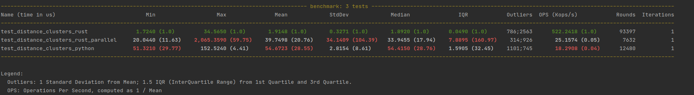

##Реализация алгоритма расчета расстояний между кластерами на `rust` и использование его в `python`

### Как использовать?
- Чтобы собрать `.so` (читай библиотеку) заходим в `./rust` и выполняем `cargo build --release`
- Копируем `./rust/target/release/librust_force.so` под именем `rust_force.so` (удалить **lib**) в `./python`
- Импортим в питоне библиотеку `import rust_force` и пользуемся

### Бенчмарки

- На обычном количестве сооружений в кластерах (*5* и *7* сооружений)  
  
  [!12_buildings](benchmark_pictures/12_buildings.png)
- На большом количестве сооружений в кластерах (*15000* и *25000* сооружений)  
  [!40k_buildings](benchmark_pictures/40k_buildings.png?raw=true)